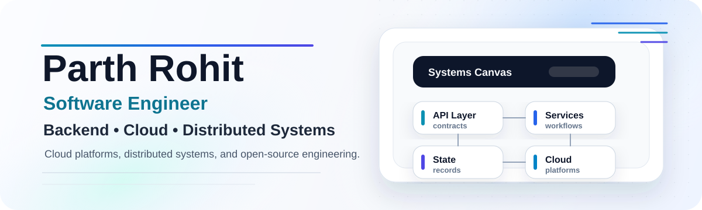

  

<h1 align="center">Parth Rohit</h1>

  <b>Backend and cloud-focused software engineer building reliable APIs, distributed state, security tooling, and data workflows.</b>

  <a href="https://www.linkedin.com/in/parthrohit">LinkedIn</a> |
  <a href="mailto:parthrohit60@gmail.com">Email</a> |
  <a href="https://github.com/parthrohit22?tab=repositories">Projects</a> |
  London, United Kingdom

  
  
  
  

  <a href="#engineering-snapshot"><b>Snapshot</b></a> |
  <a href="#selected-systems"><b>Selected Systems</b></a> |
  <a href="#technical-surface"><b>Technical Surface</b></a> |
  <a href="#experience"><b>Experience</b></a> |
  <a href="#education"><b>Education</b></a>

## Engineering Snapshot

I like building systems where correctness, ownership boundaries, and operational clarity matter. My projects sit around backend APIs, hash-linked verification, cloud security scanning, stateful edge workloads, Azure-hosted data services, and role-aware product operations.

The through-line is practical systems engineering: deterministic verification, concurrent-safe ingestion, server-enforced authorization, audit-friendly records, observability, and tests that protect behavior instead of just chasing coverage.

**Currently sharpening:** distributed state, cloud-native backend architecture, security automation, and developer-facing platform tooling.

## Selected Systems

| Project | What it demonstrates | Stack |
| --- | --- | --- |
| KALYX | Execution-integrity platform with hash-chained records, deterministic verification, concurrent-safe ingestion, FastAPI services, audit workflows, and automated tests. | Python, FastAPI, pytest |
| [OpenShield](https://github.com/openshield-org/openshield) | Open-source Azure CSPM work across security rule engineering, OWASP-oriented checks, compliance mappings, validation flows, and end-to-end platform testing. | Python, Azure SDK, Flask, PostgreSQL, GitHub Actions |
| [LYTA](https://github.com/parthrohit22/lyta) | Stateful edge workspace using Cloudflare Workers and Durable Objects, with ownership-aware workspace state, retrieval architecture, SSE streaming, and tenant boundaries. | TypeScript, Cloudflare Workers, Durable Objects, Workers AI |
| [FieldSight](https://github.com/parthrohit22/fieldsight-api) | Azure backend that separates image binaries from searchable metadata using Blob Storage, partitioned Cosmos DB records, App Service hosting, telemetry, and CI/CD. | Node.js, Express.js, Azure App Service, Cosmos DB, Blob Storage |
| [Payment Operations & Routing Analytics Platform](https://github.com/parthrohit22/Payment-Routing-System) | Backend-controlled payment operations with JWT auth, RBAC, merchant-scoped access, provider attempt history, fallback visibility, and operational analytics. | Angular, Flask, MongoDB, JWT, RBAC |

## Technical Surface

| Area | Tools and practices |
| --- | --- |
| Languages | Python, TypeScript, JavaScript, Java, SQL |
| Backend | FastAPI, Flask, Express.js, REST APIs, JWT authentication, RBAC, audit workflows, SSE streaming |
| Cloud and Infrastructure | Azure App Service, Azure Cosmos DB, Azure Blob Storage, Application Insights, Cloudflare Workers, Durable Objects, GitHub Actions, CI/CD |
| Databases | MongoDB, Azure Cosmos DB, PostgreSQL, MySQL, SQLite |
| Testing and Tooling | pytest, Vitest, JUnit, Postman, OpenAPI, Git, GitHub Actions |

## Engineering Themes

- Verifiable state, deterministic workflows, and audit-ready records
- Cloud-native APIs with clear service boundaries and deployment paths
- Security engineering, compliance automation, and platform validation
- Stateful edge systems, real-time streaming, and multi-tenant ownership models
- Observability, reliability, and practical backend operational quality

## Experience

**Operations & IT Support Assistant**  
Kukreja & Associates, Vadodara, India | July 2021 - December 2023

- Automated internal workflows, reducing recurring manual effort by 10+ hours per month.
- Supported 50+ users across hardware, software, and network issues.
- Documented repeatable support processes and improved recurring operational support flows.

## Education

**Ulster University, London**  
BSc (Hons) Computing Systems | Expected graduation: September 2026

- Dean's List in Year 1 and Year 2.
- Relevant modules: Server-Side Development, Cloud-Native Development, Full-Stack Strategies, Systems Security.

## Contact

I am always happy to talk about backend engineering, cloud systems, security tooling, and software engineering opportunities.

Email: [parthrohit60@gmail.com](mailto:parthrohit60@gmail.com)

LinkedIn: [linkedin.com/in/parthrohit](https://www.linkedin.com/in/parthrohit)
