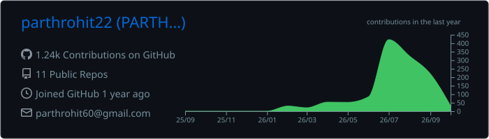
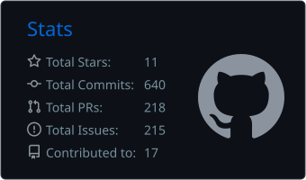
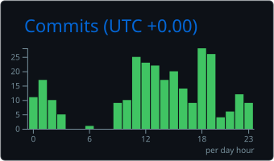
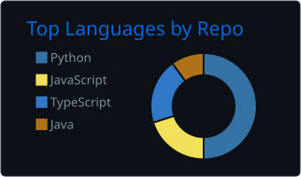
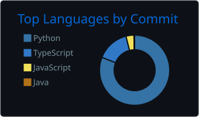

<!-- Header -->
<p align="center">
  
</p>

<p align="center">
  <a href="https://www.parthrohit.com">
    
  </a>
</p>

<p align="center">
  <a href="https://www.parthrohit.com"></a>
  <a href="https://www.linkedin.com/in/parthrohit"></a>
  <a href="mailto:parthrohit60@gmail.com"></a>
  <a href="https://www.parthrohit.com/Parth-Rohit-CV.pdf"></a>
</p>

<p align="center">
  
  
  
  
</p>

---

## `$ whoami`

<table>
<tr>
<td width="55%" valign="top">

I'm a **First Class Honours** Computing Systems graduate from Ulster University, London. I build **AI-native products** and the **backend systems** behind them.

I started out supporting more than 50 users in an operations and IT role, and that's where reliability stopped being theory for me. Now I design the evidence path alongside the feature. You can see where each fact came from and who owns the state. When a dependency fails, the system does something clear. Another engineer can reproduce the result or challenge it.

🔭 Building **PARTHA**: repository intelligence that links every answer back to the source<br/>
🛡️ Official maintainer of **OWASP OpenShield**, an OWASP Incubator Project<br/>
🏆 **QA Ltd Best Computing Project Award** 2026 · Dean's List, Years 1 and 2<br/>
💼 **Open to full-time software engineering roles in London, starting now**

</td>
<td width="45%" valign="top">

```python
from dataclasses import dataclass, field

@dataclass(frozen=True)
class Engineer:
    name: str
    role: str
    based_in: str
    degree: str
    builds: list[str] = field(default_factory=list)
    principle: str = ""
    available: bool = False


me = Engineer(
    name="Parth Rohit",
    role="Software Engineer",
    based_in="London, UK",
    degree="BSc (Hons) Computing Systems, "
           "First Class Honours, Ulster 2026",
    builds=[
        "AI-native products",
        "backend & API systems",
        "durable, distributed state",
        "cloud security tooling",
    ],
    principle="If an output can't be traced, "
              "it isn't finished.",
    available=True,  # immediate start
)
```

</td>
</tr>
</table>

---

## 🧱 Selected work

<table>
<tr>
<td width="50%" valign="top">

### [🧠 PARTHA](https://github.com/parthrohit22/PARTHA)
<a href="https://github.com/parthrohit22/PARTHA"></a> <a href="https://github.com/parthrohit22/PARTHA/commits"></a>

**Repository intelligence.** Answers about a codebase that link back to the source. Analysis jobs are durable and cancellable, with bounded retry and recovery from stalled workers.

<code>Python</code> <code>FastAPI</code> <code>React</code> <code>PostgreSQL</code> <code>Redis</code> <code>Docker</code>

</td>
<td width="50%" valign="top">

### [🛡️ OWASP OpenShield](https://github.com/OWASP/openshield)
<a href="https://github.com/OWASP/openshield"></a> <a href="https://github.com/OWASP/openshield/commits"></a>

**An OWASP Incubator Project for Azure security posture management.** As an official maintainer, I review and merge pull requests, triage and prioritise issues, and track roadmap milestones. CODEOWNER for tests and docs. I built CI auditing that flags branch-protection policy drift. Unreviewed evidence never counts as a pass.

<code>Python</code> <code>Flask</code> <code>PostgreSQL</code> <code>React</code>

</td>
</tr>
<tr>
<td width="50%" valign="top">

### [🔗 KALYX](https://github.com/parthrohit22/kalyx)
<a href="https://github.com/parthrohit22/kalyx"></a> <a href="https://github.com/parthrohit22/kalyx/commits"></a>

**Dissertation: tamper-evident execution logs.** Records are hash-chained, and checkpoints are anchored to a separate Raspberry Pi. Detection is rule-based, so every alert can be explained.

<code>Python</code> <code>FastAPI</code> <code>Angular</code> <code>Raspberry Pi</code>

</td>
<td width="50%" valign="top">

### [⚡ LYTA](https://github.com/parthrohit22/lyta)
<a href="https://github.com/parthrohit22/lyta"></a> <a href="https://github.com/parthrohit22/lyta/commits"></a>

**Stateful AI at the edge.** Runs deterministically under concurrency, using Durable Objects and SSE streaming.

<code>TypeScript</code> <code>Cloudflare Workers</code> <code>Durable Objects</code> <code>Workers AI</code>

</td>
</tr>
<tr>
<td width="50%" valign="top">

### [💷 Trevad](https://github.com/parthrohit22/trevad)
<a href="https://github.com/parthrohit22/trevad"></a> <a href="https://github.com/parthrohit22/trevad/commits"></a>

**Explainable affordability decisions.** Forecasts 90 days of cash flow, then recommends paying now, in part, in instalments, waiting or not going ahead.


</td>
<td width="50%" valign="top">

### [📦 ReturnProof](https://github.com/parthrohit22/ReturnProof)
<a href="https://github.com/parthrohit22/ReturnProof"></a> <a href="https://github.com/parthrohit22/ReturnProof/commits"></a>

**Evidence-driven return reconciliation agent.** Resolves conflicting warehouse and supplier data with deterministic routing, reasoning about timing and auditable decisions.


</td>
</tr>
</table>

<p align="center"><a href="https://www.parthrohit.com/work"><b>See case studies on the portfolio →</b></a></p>

---

## 🛠️ Tech stack

<p align="center">
  <br/>
  <br/>
  
</p>

<details>
<summary><b>Full breakdown</b></summary>
<br/>

| Area | Tools |
| --- | --- |
| **Languages** | Python · TypeScript · JavaScript · SQL · C++ |
| **Backend & data** | FastAPI · Django · Django Ninja · Flask · Express · Pydantic · PostgreSQL · Redis · MongoDB · SQLite · SQLAlchemy · Alembic |
| **AI systems** | LLM integrations · RAG · Embeddings · Retrieval & citations · Output validation · Model evaluation · MCP · Workers AI |
| **Cloud & delivery** | Microsoft Azure · Cloudflare Workers · Durable Objects · Docker · GitHub Actions · CI/CD · Application Insights |
| **Testing & security** | pytest · Vitest · Playwright · CodeQL · Dependency audits · Failure-path testing · RBAC |

</details>

---

## 🧭 How I engineer

| Concern | What I hold the work to |
| --- | --- |
| 🤖 **AI behaviour** | Grounded context, citations where evidence matters, clear output boundaries |
| 🗄️ **Backend systems** | Typed contracts, explicit ownership, durable state, defensible data decisions |
| 🔁 **Reliability** | Tested failure paths, controlled errors, tests beyond the happy path |
| 🔐 **Trust** | Provenance, audit history, deterministic checks, honest limits on what a system can do |
| 🚢 **Delivery** | Readable repositories, meaningful pull requests, CI, review gates, documentation |

---

## 📈 GitHub activity

<p align="center">
  
</p>

<p align="center">
  
  
</p>

<p align="center">
  
  
</p>

<p align="center">
  
</p>

<p align="center">
  <picture>
    <source media="(prefers-color-scheme: dark)" srcset="https://raw.githubusercontent.com/parthrohit22/parthrohit22/output/github-snake-dark.svg" />
    <source media="(prefers-color-scheme: light)" srcset="https://raw.githubusercontent.com/parthrohit22/parthrohit22/output/github-snake.svg" />
    
  </picture>
</p>

---

## 🏅 Recognition

| | |
| --- | --- |
| 🎓 | **BSc (Hons) Computing Systems, First Class Honours** · Ulster University, London · 2026 |
| 🏆 | **Best Computing Project Award** · QA Ltd, university technology fest · 2026 |
| ☁️ | **Oracle Cloud Infrastructure Certified Architect Associate** · 2026 |
| 📜 | **Oracle Agentic AI Certified Foundations Associate** · 2026 |
| 🗄️ | **Oracle SQL Explorer** · Oracle Learning Explorer completion badge · core SQL, DDL/DML and schema design |
| 🧩 | **Microsoft Learn completion** · Build enterprise-grade tool ecosystems with MCP and Microsoft Foundry |
| ⭐ | **Dean's List** · Years 1 and 2 |
| 🤝 | **Student Representative & SSCC member** · 2024 to 2026 · taught 15+ peers practical AI and development workflows |

---

<p align="center">
  <b>Hiring for a software engineer in London? I can start now.</b><br/><br/>
  <a href="mailto:parthrohit60@gmail.com"></a>
</p>


